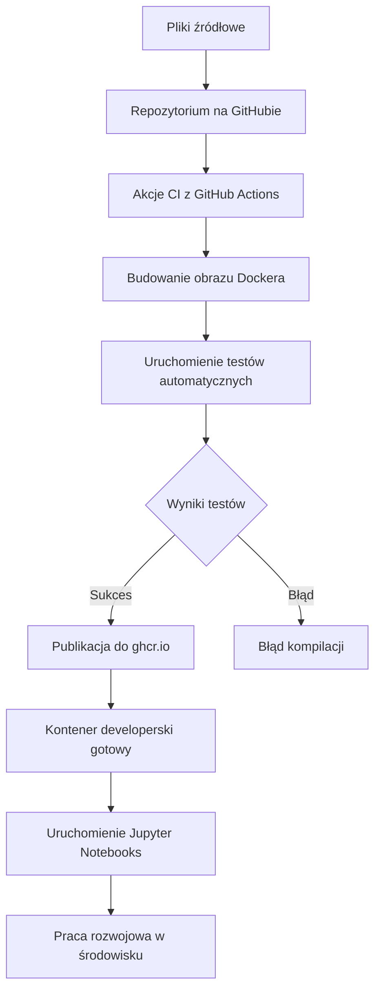

# Raport z projektu
## Sieć Jako Usługa

**Obliczenia kwantowe z IBM Qiskit**

---

# Konfiguracja repozytorium

## Kroki realizacji:

- Fork repozytorium bazowego na własne konto
- Projekt założony lokalnie w Visual Studio Code
- Test budowania obrazu Docker: `docker build -t sjuprojekt .`
- Uruchomienie kontenera: `docker run -it --rm -v .:/home/vscode/workspace sjuprojekt bash`
- Weryfikacja dostępu do plików projektu: `ls /home/vscode/workspace`
- Repozytorium połączone z GitHub przez `git remote add origin`
  
## Komendy git:

```bash
git init
git remote add origin <adres_repo>
git add .
git commit -m "Initial commit"
git push -u origin main
```

W rezultacie otrzymano działające środowisko gotowe do modyfikacji


---

# Modyfikacja Dockerfile

## Instalacja pakietów w środowisku Dockera

- W środowisku **VS Code** skorzystałem z rozszerzenia **Dev Containers**, które umożliwia konfigurację kontenera z poziomu edytora.
- Zmodyfikowałem plik `Dockerfile`, aby instalował niezbędne pakiety:
  - `qiskit`
  - `matplotlib`
  - `pillow`
  - `pycryptodomex`
  - `cryptography`
  - oraz dodatkowo: `ipykernel`, `jupyter`
- Instalacja odbywa się za pomocą polecenia:
```dockerfile
RUN pip install --no-cache-dir \
  qiskit \
  matplotlib \
  pillow \
  pycryptodomex \
  cryptography
```
Po wykonaniu tych akcji obraz bez błędów został ponownie zbudowany

---
# Konfiguracja kontenera deweloperskiego
## Plik `.devcontainer/devcontainer.json`
```json
{
  "workspaceMount": "source=${localWorkspaceFolder},target=/home/vscode/workspace,type=bind,consistency=cached",
  "workspaceFolder": "/home/vscode/workspace",
  "name": "Projekt-SJU",
  "image": "ghcr.io/piotrkwia/projekt_sju:latest",
  "customizations": {
    "vscode": {
      "extensions": [
        "ms-python.python",
        "ms-toolsai.jupyter",
        "yzhang.markdown-all-in-one",
        "marp-team.marp-vscode",
        "github.vscode-github-actions"
      ]
    }
  },
  "postCreateCommand": "pip install --no-cache-dir -r requirements.txt && uname -a && python --version && pip --version",
  "remoteUser": "vscode"
}
```
## Kroki wykonane w VSCode
- Utworzono plik `.devcontainer/devcontainer.json` z odpowiednimi ustawieniami.
- Dodano wymagane rozszerzenia do VSCode w sekcji `customizations`.
- Skonfigurowano automatyczne instalowanie zależności po starcie kontenera (`postCreateCommand`).
- Wykorzystano gotowy obraz Dockera: `ghcr.io/piotrkwia/projekt_sju:latest`.
- Środowisko zostało uruchomione lokalnie w edytorze VSCode jako kontener developerski.
**Rozszerzenia dodane w VScode:** Markdown All in One, Marp for VS Code, GitHub Actions
---

# GitHub Actions – CI/CD Pipeline

- Utworzono folder `.github/workflows` w katalogu głównym projektu.
- Dodano plik `docker-build.yml` konfiguracyjny definiujący prosty pipeline CI.
- Pipeline uruchamia się automatycznie przy każdym `push` i `pull_request` do gałęzi `main`.
- Wykonywane kroki w workflow:
  - Ustawienie środowiska (checkout kodu, instalacja Pythona).
  - Instalacja zależności z `requirements.txt`.
  - Walidacja składni i poprawności kodu (lint/test).

```yaml
name: Build, Test and Publish Docker Image

on:
  workflow_dispatch:
  release:
    types: [created]

env:
  REGISTRY: ghcr.io
  IMAGE_NAME: piotrkwia/projekt_sju

jobs:
  build:
    runs-on: ubuntu-latest

    steps:
      - name: Checkout repository
        uses: actions/checkout@v3

      - name: Set up Docker Buildx
        uses: docker/setup-buildx-action@v3

      - name: Log into registry ${{ env.REGISTRY }}
        uses: docker/login-action@v3
        with:
          registry: ${{ env.REGISTRY }}
          username: ${{ github.actor }}
          password: ${{ secrets.CR_PAT }}

      - name: Build Docker image
        run: docker build -t ${{ env.REGISTRY }}/${{ env.IMAGE_NAME }}:latest .

      - name: Run test script inside container
        run: |
          docker run --rm ${{ env.REGISTRY }}/${{ env.IMAGE_NAME }}:latest python /home/vscode/workspace/test.py

      - name: Push image to GitHub Container Registry
        run: docker push ${{ env.REGISTRY }}/${{ env.IMAGE_NAME }}:latest
        
```

Wykonane testy:
```python
def test_imports():
    packages = [
        "qiskit",
        "matplotlib",
        "PIL",  # Pillow
        "Cryptodome",  # Pycryptodomex
        "cryptography"
    ]

    for pkg in packages:
        try:
            __import__(pkg)
            print(f"✅ {pkg} - OK")
        except ImportError:
            print(f"❌ {pkg} - MISSING")
            exit(1)

if __name__ == "__main__":
    test_imports()

```

---

# Diagram przebiegu pracy

<div class="flex justify-center">



</div>

<!--
1. Automatyzacja całego procesu od kodu do gotowego środowiska
2. Testy zapewniają jakość obrazu przed publikacją
-->

---

# Praca z Jupyter Notebooks

## W środowisku lokalnym (VSCode)

- Do pracy z notebookami użyto rozszerzenia `Jupyter` dostępnego w edytorze Visual Studio Code.
- Notatniki `.ipynb` były uruchamiane i edytowane lokalnie wewnątrz kontenera developerskiego.
- Środowisko było oparte na wcześniej skonfigurowanym obrazie Dockera oraz pliku `devcontainer.json`.
- Kernel był przypisany do wirtualnego środowiska `.venv`, dzięki czemu wszystkie zależności były dostępne.
- Notebooks wykorzystywały bibliotekę `Qiskit` do wysyłania zadań na komputer kwantowy IBM Quantum.
- Dzięki integracji z Jupyter możliwa była bezpośrednia wizualizacja wyników i interaktywna analiza danych.

<!--
Pokazano jak uruchamiane były notebooki w VSCode zamiast na stronie IBM Quantum.
-->

---

# Wyzwania i doświadczenia

## Co było najtrudniejsze:

- Konfiguracja GitHub Actions z odpowiednimi uprawnieniami do publikacji obrazu
- Rozwiązywanie błędów pojawiających się podczas budowy obrazu Dockera
- Utrzymanie spójności wersji obrazu między devcontainerem a rejestrem kontenerów

## Czego się nauczyłem:

- Jak praktycznie stosować konteneryzację przy pracy z VSCode i Dockerem
- Jak zautomatyzować procesy CI/CD z użyciem GitHub Actions
- W jaki sposób integrować różne technologie cloud-native w ramach jednego projektu

## Co można ulepszyć:

- Projekt mógłby zawierać więcej przykładów wykorzystania zadań kwantowych
- Warto rozważyć szerszą automatyzację testów i walidacji konfiguracji środowiska

---

# Podsumowanie i rozwój

## Zrealizowane elementy:

✅ Skonfigurowane środowisko programistyczne w kontenerze  
✅ W pełni działający pipeline CI/CD z GitHub Actions  
✅ Publikacja obrazu do GitHub Container Registry  
✅ Integracja i uruchamianie notebooków Jupyter w kontenerze  
✅ Możliwość dalszej rozbudowy środowiska o nowe rozszerzenia VSCode  

